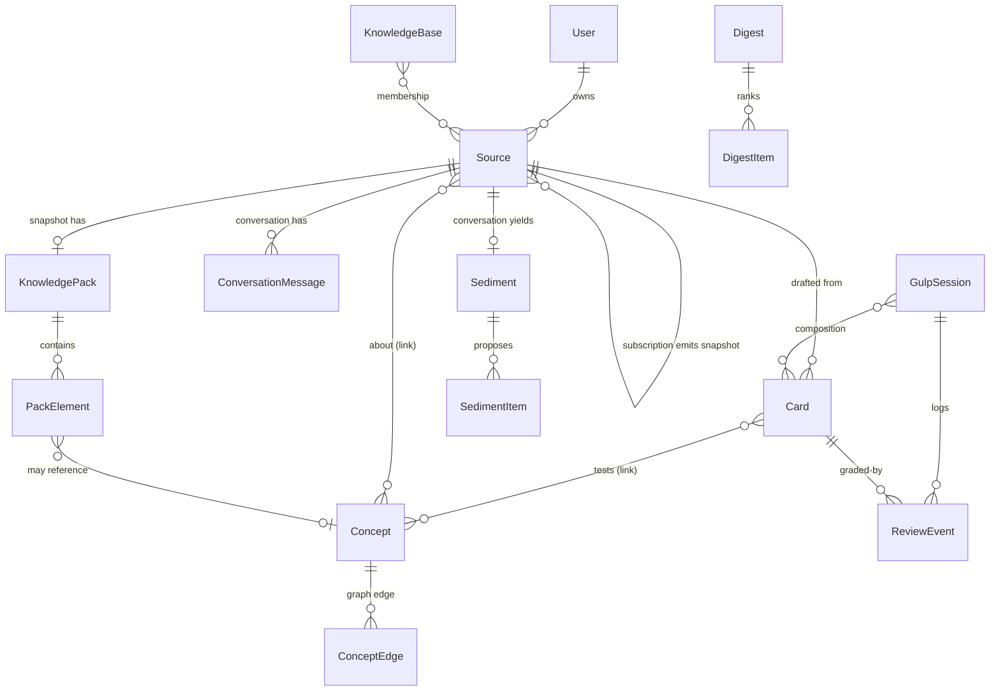

# 02 — Data Model

*Gulp · logical data model · v1 · 2026-06-23*

> Companion to [`00-product-one-pager.md`](00-product-one-pager.md) (the *what/why*) and [`01-interaction-spec.md`](01-interaction-spec.md) (the *how the user moves through it*). This doc defines **the objects the product is made of** — their fields, states, relationships, and the rules that must always hold.
>
> **Altitude:** logical / domain model. It is technology-agnostic — entities, logical types, lifecycle states, cardinality, and invariants — **not** a physical schema. No SQL, no chosen datastore, no indexes. The concrete data/API contract (DDL, types, sync protocol) is a later doc; `01 §11` flagged it as such, and this doc is the bridge to it.
>
> Where `01` left a data-model question open (`01 §11`), this doc **resolves it with a decision** and marks whether the decision is reversible (§8).

---

## 1. Scope & reading guide

- **Covers:** every object named in `01 §4.2` (the spine) plus the operational objects the flows in `01 §5` require (sessions, review events, digests, sediment). One subsection per entity in §4.
- **Faithful to `01`, not `00`.** `00 §MVP` listed a longer object set (`Source · Claim · Concept · Question · Card · Conversation · Insight`); `01 §4.2` deliberately pruned it — *Claim* and *Question* are folded into the knowledge pack and Cards, *Insight* is "just a free-form Card." This doc follows the pruned `01` set.
- **The spine drives the layout.** Read every entity through the one-line model from `01 §4.1`:
  > You **save** things → Gulp **digests** them → turns them into **practice** → tracks what you **master** → and lets you **organize** it.
- **Out of scope:** physical storage, query/index design, API shapes, auth, the realtime sync wire protocol (only its *effect* on fields is modeled, §2.3). Anything in `01 §11` "Deferred" stays deferred here (§9).

---

## 2. Modeling conventions

### 2.1 Type legend

| Notation | Meaning |
|---|---|
| `ID` | opaque unique identifier |
| `string` / `text` | short / long free text |
| `enum{a·b·c}` | closed set of values |
| `bool` `int` `float` | scalars |
| `timestamp` | instant (UTC) |
| `X?` | nullable / optional |
| `X[]` | ordered or set-valued collection of `X` |
| `→Entity` | reference to another entity (by `ID`) |
| *value object* | a structured value owned inline by its parent, not independently addressable |

### 2.2 Fields implicit on every entity

To avoid repetition, every entity below **also** carries these and they are omitted from the per-entity tables:

| Field | Type | Notes |
|---|---|---|
| `id` | `ID` | stable, globally unique |
| `owner` | `→User` | single owner in v1 (no sharing — `01 §1`) |
| `created_at` | `timestamp` | |
| `updated_at` | `timestamp` | drives sync conflict resolution (§2.3) |
| `deleted_at` | `timestamp?` | **soft delete**; rows are tombstoned, never hard-deleted, so sync and "no silent data loss" (`01 §10.7`) hold |

### 2.3 Sync-shaped fields

`01 §3` defines the sync rule; the data model honors it structurally rather than with a protocol:

- **Scalars** resolve **last-write-wins** by `updated_at`. No per-field vector clocks in v1.
- **Collections** (e.g. `tags`, knowledge-base memberships, concept links) resolve by **union**. They are therefore modeled as sets / join entities, never as a single scalar blob that one writer could clobber.
- **Offline capture** is just a normal entity created locally with status `queued`; it uploads on reconnect (`01 §10.4`). No special "draft" type.

### 2.4 Derived vs. stored

Some values are **never stored** — they are computed on read so they can't drift out of sync (§9 invariant). They are listed in entity tables tagged *(derived)*. The two big ones: the daily 3-state mastery view and the `due` flag (both derived from `MasteryState` + `SchedulingState`, §5), and the **Inbox** (a derived view over `Snapshot`, §8).

---

## 3. The model at a glance

The entity set, grouped by the spine step it serves:

| Spine step | Entities |
|---|---|
| **Save** | `Source` → `Snapshot` · `Conversation` · `Subscription` |
| **Digest** | `KnowledgePack`, `PackElement` |
| **Practice** | `Card`, `GulpSession`, `ReviewEvent` |
| **Master** | `MasteryState` (vo), `SchedulingState` (vo), `Concept`, `ConceptEdge` |
| **Organize** | `KnowledgeBase`, `Digest` / `DigestItem` |
| **(account)** | `User` |
| **(capture-from-chat)** | `ConversationMessage`, `Sediment` / `SedimentItem` |

> `Snapshot`, `Conversation`, and `Subscription` are the three **forms of `Source`** (one entity, `kind` discriminator — §4.2). The diagram draws them as `Source` to keep the umbrella visible; the self-reference *"subscription emits snapshot"* is one `Source` row pointing at another.

---

## 4. Core entities

### 4.1 `User`

The account. Holds the few settings the flows reference; everything else hangs off it via `owner`.

| Field | Type | Notes |
|---|---|---|
| `display_name` | `string?` | |
| `locale` | `enum{zh·en}` | v1 languages (`01 §11`) |
| `auto_approve_default` | `bool` | global review-gate skip (`01 §F2`); per-feed override lives on `Subscription` |
| `gulp_session_minutes` | `int` | default session length (default 5; `01 §F4`) |
| `daily_reminder_at` | `string?` | local time-of-day for the Gulp reminder (`01 §F9`) |
| `notification_prefs` | *value object* | per-type opt-in + quiet mode (`01 §F9`) |

> Notification *delivery* is ephemeral and not modeled as a stored entity in v1 — only the **preferences** above are durable. Each notification deep-links to one next action at send time.

---

### 4.2 `Source`

`Source` is abstract — you never store a bare Source, only one of three **forms**, distinguished by `kind`. One entity, one discriminator, form-specific fields nullable when not applicable (the *single-table-with-`kind`* decision, §8). This mirrors `01 §4.2` directly: *"Source is the umbrella; you create one of its three forms."*

**Shared fields (all forms):**

| Field | Type | Notes |
|---|---|---|
| `kind` | `enum{snapshot·conversation·subscription}` | the discriminator |
| `title` | `string` | detected at capture or user-set |
| `note` | `text?` | optional one-line note from capture (`01 §F1`) |
| `tags` | `string[]` | union-on-conflict (§2.3) |
| `status` | `enum` | **domain depends on `kind`** — see the form below and the consolidated state machines (§6) |

The form-specific fields follow in §4.3–4.5. Knowledge-base membership is a join, not a field (§4.9).

> **Mastery on a Source is *derived*, not stored.** A Source has no `MasteryState` of its own; its mastery is a rollup of its Cards' states (§5.1). Only `Card` and `Concept` store mastery.

---

### 4.3 `Snapshot` (`kind = snapshot`)

The frozen, point-in-time item — "the everyday thing you gulped" (`01 §4.2`). Fields present when `kind = snapshot`:

| Field | Type | Notes |
|---|---|---|
| `media_type` | `enum{article·pdf·video·podcast·note·screenshot·audio·webpage}` | |
| `origin_url` | `string?` | original reference (null for manual note / screenshot / audio memo) |
| `content_body` | `text?` | **stored extracted content** — the link-rot-proof copy (§8 decision) |
| `content_ref` | `string?` | pointer to the stored original/blob (media, raw file) |
| `captured_via` | `enum{share_sheet·wechat·email·in_app·paste·manual·screenshot·audio_memo}` | provenance (`01 §F1`) |
| `emitted_by` | `→Source?` | the `Subscription` that produced it; null for ad-hoc captures (`01 §F6`) |
| `pack` | `→KnowledgePack?` | 1–1; null until generated, and null forever for unsupported content (`01 §10.3`) |

**`status` domain (the capture/review lifecycle, `01 §F1`/`§F2`):**
`unprocessed` → `processing` → `ready` → `awaiting_review` → `in_library`, with `queued` for the offline buffer and the branch `needs_attention` (extraction failed). Processing is **manually triggered** in v1 — a captured snapshot rests at `unprocessed` until the user starts it (or imports an externally-produced result), per S2 design §2.4. `awaiting_review` is skipped when auto-approve applies (→ straight to `in_library`). Full transitions in §6.

---

### 4.4 `KnowledgePack` + `PackSection` / `PackBlock` + `PackElement`

The AI-generated **digest, authored as a readable report** — not a flat summary. Exists **only** for a `Snapshot` (invariant, §9). *Structure resolved in S2 design ([`subsystems/S2-processing-design.md §3`](subsystems/S2-processing-design.md)).*

**`KnowledgePack`**

| Field | Type | Notes |
|---|---|---|
| `snapshot` | `→Source` | the `kind=snapshot` it digests (1–1) |
| `summary` | `text` | pack-level abstract |
| `background` | `text?` | |
| `confidence` | `float?` | low/thin-content signal — drives "only what's reliable, and says so" (`01 §F2`) |
| `status` | `enum{generating·ready}` | |

**`PackSection` / `PackBlock`** — the **report the user reads** (the spine). A pack has ordered `PackSection`s, each holding ordered `PackBlock`s; every block anchors back to the source for grounding / "open original".

| `PackSection` field | Type | Notes |
|---|---|---|
| `pack` | `→KnowledgePack` | parent |
| `heading` | `string?` | |
| `position` | `int` | order within the pack |

| `PackBlock` field | Type | Notes |
|---|---|---|
| `section` | `→PackSection` | parent |
| `block_type` | `enum{prose·figure·callout·quote}` | `figure` = mermaid source (text) or a blob ref |
| `content` | `text?` | prose body / figure source |
| `content_ref` | `string?` | blob pointer for raster figures (deferred) |
| `source_anchor` | *value object*`?` | coordinate back into the source — `{kind: char_range·page·timestamp, …}` |
| `anchor_id` | `string` | stable id; chat, annotations, and Cards attach here |
| `position` | `int` | order within the section |

**`PackElement`** — the reviewable **facet-annotations** layered on the report (terms, people, claims, counter-views, connections). One entity with a discriminator keeps the `suggested → kept/dismissed` review state uniform; each hangs on the report block it annotates.

| Field | Type | Notes |
|---|---|---|
| `pack` | `→KnowledgePack` | parent |
| `element_type` | `enum{key_term·person_org·claim·counter_view·connection}` | |
| `text` | `text?` | the gloss/claim/counter-view body |
| `concept` | `→Concept?` | set for `key_term`, `person_org`, and `connection` (the linked Concept) |
| `block` | `→PackBlock?` | the report block this annotation hangs on (`anchor_id`) |
| `section_label` | `string?` | for section-chunked long content (`01 §F2`) |
| `state` | `enum{suggested·kept·dismissed}` | `01 §F2` |

> The **report (`PackSection`/`PackBlock`) is the reading deliverable** — read/editable, not reviewed block-by-block. The **facets (`PackElement`) are reviewed** `suggested → kept/dismissed`. *Key terms*/*people/orgs* become links to `Concept`; *connections* become `ConceptEdge`s (both created/normalized on commit, S3); *claims*/*counter-views* can be promoted to a `Card`. The pack is a **living document** — user-triggered figures and accepted conversation sediment append new blocks after generation.

---

### 4.5 `Card`

The atomic, testable unit — "the unit of Gulp mode and scheduling" (`01 §4.2`). A **user takeaway is just a `Card` with `origin = user`** — there is no separate *Insight* entity.

| Field | Type | Notes |
|---|---|---|
| `source` | `→Source?` | what it was drafted from (null allowed for a standalone takeaway) |
| `card_type` | `enum{short_answer·mcq·cloze·explain·apply·recall}` | `recall` = "say it in your own words" (`01 §F4`) |
| `prompt` | `text` | |
| `answer` | `text?` | canonical answer or rubric for AI feedback |
| `explanation` | `text?` | source-grounded reveal explanation (`01 §F4`; S2 design §4) |
| `options` | `string[]?` | choices for `mcq` |
| `origin` | `enum{pack·conversation·user}` | drafted from a pack, sedimented from a conversation, or hand-authored |
| `status` | `enum{draft·accepted·rejected}` | enters scheduling only at `accepted` (invariant, §9) |
| `scheduling` | `SchedulingState` (vo) | §5.2 — meaningful only once `accepted` |
| `mastery` | `MasteryState` (vo) | §5.1 |

Concept attachments are a join, not a field (§4.6).

---

### 4.6 `Concept` + `ConceptEdge`

The normalized idea/term/person/org and the edges between them — "the spine of the knowledge graph" (`01 §4.2`).

**`Concept`**

| Field | Type | Notes |
|---|---|---|
| `concept_type` | `enum{idea·term·person·org}` | *people/orgs from a pack are Concepts of this subtype* — not a separate entity |
| `name` | `string` | normalized canonical name |
| `aliases` | `string[]?` | merge targets / surface forms |
| `definition` | `text?` | |
| `mastery` | `MasteryState` (vo) | aggregate rollup over linked Cards; stored denormalized for the Concept page (`01 §F3`) |

**`ConceptEdge`** — typed, directed edge; the graph is `Concept`-to-`Concept` many-to-many via this entity.

| Field | Type | Notes |
|---|---|---|
| `from_concept` | `→Concept` | |
| `to_concept` | `→Concept` | |
| `relation` | `enum{related·part_of·contrasts·causes·example_of}` | extensible |
| `weight` | `float?` | connection strength |

**Typed links** (each a join entity so they union under sync, §2.3):

| Link | From → To | Carries |
|---|---|---|
| `CardConcept` | `Card → Concept` | `role?` (what the Card tests about the Concept) |
| `SourceConcept` | `Source → Concept` | `role?` (`mentions` / `about`) |

---

### 4.7 `Conversation` (`kind = conversation`) + messages + sediment

A Conversation is itself a **form of `Source`** (`01 §F5`) — an interactive one — so what it yields lands in the same library. Fields present when `kind = conversation`:

| Field | Type | Notes |
|---|---|---|
| `anchor_type` | `enum{source·concept·card·knowledge_base·pack_block·none}` | what it's anchored to (`01 §F5`); `pack_block` = a block inside a pack report (S2 design §3) |
| `anchor_ref` | `ID?` | the anchored object (polymorphic; null when `anchor_type = none`) |
| `sediment` | `→Sediment?` | produced on save |

**`status` domain:** `active` → `saved` (with sediment) / `discarded`. Discard keeps the row and its messages — it just creates no Cards (no silent loss; `01 §10.7`, §9 invariant).

**`ConversationMessage`** (child entity, ordered)

| Field | Type | Notes |
|---|---|---|
| `conversation` | `→Source` | the `kind=conversation` parent |
| `role` | `enum{user·assistant}` | |
| `text` | `text` | |
| `citations` | `→Source[]` | the citation chips — Sources the answer grounds on (`01 §F5`) |

**`Sediment`** — the "save what I learned" proposal; a thin parent over its items.

| Field | Type | Notes |
|---|---|---|
| `conversation` | `→Source` | |

**`SedimentItem`** — same `suggested → kept/dismissed` shape as `PackElement`, different source.

| Field | Type | Notes |
|---|---|---|
| `sediment` | `→Sediment` | parent |
| `item_type` | `enum{new_point·corrected_misconception·candidate_card·concept_touched·question_to_review}` | `01 §F5` |
| `text` | `text?` | |
| `concept` | `→Concept?` | for `concept_touched` |
| `card` | `→Card?` | set when a `candidate_card`/`question_to_review` is `kept` and promoted |
| `state` | `enum{suggested·kept·dismissed}` | |

---

### 4.8 `Subscription` (`kind = subscription`)

The streaming form of `Source` — "a followed feed that auto-emits Snapshots" (`01 §4.2`/`§F6`). Fields present when `kind = subscription`:

| Field | Type | Notes |
|---|---|---|
| `feed_type` | `enum{rss·newsletter·channel}` | |
| `feed_address` | `string` | URL / newsletter address / channel id |
| `auto_approve` | `bool` | **per-feed override** of `User.auto_approve_default` (`01 §F2`/`§F6`) |
| `muted` | `bool` | "too much from here" control (`01 §F6`) |
| `unread_count` | `int` | |
| `last_fetch_at` | `timestamp?` | |

**`status` domain:** `active` / `muted` / `error` (fetch error — surfaced on Feeds, never blocks the digest; `01 §F6`).

> Emitted Snapshots point **back** at the Subscription via `Snapshot.emitted_by` (§4.3) — a `Source → Source` reference, not a separate join.

---

### 4.9 `KnowledgeBase` + membership

A named collection that scopes browsing, digests, and Gulp sessions (`01 §4.2`). A Source may belong to several → many-to-many.

**`KnowledgeBase`**

| Field | Type | Notes |
|---|---|---|
| `name` | `string` | |
| `description` | `text?` | |

**`KBMembership`** (join; union-on-conflict, §2.3)

| Field | Type | Notes |
|---|---|---|
| `knowledge_base` | `→KnowledgeBase` | |
| `source` | `→Source` | |

> **There is no "Inbox" entity.** Inbox is a derived view, not a stored KB (§8 decision). Deleting a KB tombstones the KB and its memberships — never the member Sources (§9 invariant).

---

### 4.10 `GulpSession` + `ReviewEvent`

The daily learning session (`01 §F4`) and the immutable grade log that feeds scheduling (`01 §F7`).

**`GulpSession`**

| Field | Type | Notes |
|---|---|---|
| `scope_type` | `enum{daily·knowledge_base·concept·free_explore·at_risk}` | how the session was launched (`01 §F4`) |
| `scope_ref` | `ID?` | the KB / Concept for a scoped session |
| `target_minutes` | `int` | from `User.gulp_session_minutes`, overridable per session |
| `composition` | `→Card[]` | the interleaved items: new + due + retests (`01 §F4`) |
| `status` | `enum{building·active·complete·abandoned}` | `abandoned` is **resumable** (`01 §F4`/`§8`) |
| `started_at` | `timestamp?` | |
| `completed_at` | `timestamp?` | |

The session summary (items reviewed, new mastered, still-fuzzy, streak) is **derived** from the session's `ReviewEvent`s, not stored.

**`ReviewEvent`** — append-only; one per graded item.

| Field | Type | Notes |
|---|---|---|
| `session` | `→GulpSession` | |
| `card` | `→Card` | |
| `grade` | `enum{got_it·fuzzy·missed}` | the self-grade (`01 §F4`/`§F7`) |
| `response` | `text?` | the user's free response, when captured |
| `at` | `timestamp` | |

> `ReviewEvent`s are the source of truth for review history. `Card.scheduling` is a **fold** over them (§9 invariant) — which is what keeps the FSRS swap (`01 §11`) a pure-algorithm change.

---

### 4.11 `Digest` + `DigestItem`

The curated stream (`01 §F6`): the Daily digest and Weekly review. A digest is an assembled, ranked selection — not a feed dump.

**`Digest`**

| Field | Type | Notes |
|---|---|---|
| `digest_type` | `enum{daily·weekly}` | daily digest vs. weekly review |
| `period` | `string` | the day/week it covers |

**`DigestItem`**

| Field | Type | Notes |
|---|---|---|
| `digest` | `→Digest` | |
| `ref_type` | `enum{snapshot·card·concept}` | what the item points at |
| `ref` | `ID` | the referenced object |
| `rank` | `int` | order in the stream |
| `reason` | `text` | "why it's worth your time / how it connects" (`01 §F6`) |
| `state` | `enum{unseen·read·gulped·dismissed}` | `01 §F6` |

---

## 5. Cross-cutting value objects

These are owned **inline** by their parents (not independently addressable) and appear on multiple entities.

### 5.1 `MasteryState`

`01 §F7` is explicit: **store the fine-grained ladder; surface three states.** So the ladder rung is the only stored field — the daily view and `due`/`at_risk` are derived.

| Field | Type | Notes |
|---|---|---|
| `ladder` | `enum{unread·read·summarized·can_recall·can_distinguish·can_apply·mastered}` | **stored** — the 7-rung ladder (`01 §F7`) |
| `daily` | *(derived)* `enum{new·learning·known}` | the 3-state day-to-day view |
| `due` | *(derived)* `bool` | `true` when `SchedulingState.next_review_at ≤ now` |
| `at_risk` | *(derived)* `bool` | approaching forgetting (drives "at risk" nudges & weekly list) |

**Ladder → daily mapping** (the derivation, single source of truth):

| `ladder` | `daily` |
|---|---|
| `unread`, `read` | `new` |
| `summarized`, `can_recall`, `can_distinguish` | `learning` |
| `can_apply`, `mastered` | `known` |

- Carried (stored) by **`Card`** and **`Concept`**.
- **`Source`** and **`KnowledgeBase`** mastery is a *rollup* of their Cards' states — derived, never stored (§4.2 note, §9 invariant).

### 5.2 `SchedulingState`

The per-`Card` review schedule. v1 is the simple interval model of `01 §F7`; the extra fields are reserved so FSRS drops in without an interaction change.

| Field | Type | Notes |
|---|---|---|
| `interval_days` | `float` | current spacing; lengthens on `got_it`, resets/shortens on `missed` |
| `ease` | `float` | difficulty multiplier (v1 simple model) |
| `next_review_at` | `timestamp` | drives `due` and session composition |
| `last_reviewed_at` | `timestamp?` | |
| `reps` | `int` | successful reviews |
| `lapses` | `int` | misses |
| `stability` | `float?` | **reserved for FSRS** (`01 §11`); unused in v1 |
| `difficulty` | `float?` | **reserved for FSRS**; unused in v1 |

> Meaningful only once `Card.status = accepted`. A `draft`/`rejected` Card carries an empty schedule (§9 invariant).

---

## 6. Lifecycle state machines (consolidated)

Every `status`/`state` field, in one place. (`Source.status` is split by form, since the discriminator selects the domain.)

| Entity · field | States | Transitions |
|---|---|---|
| **`Snapshot.status`** | `queued · unprocessed · processing · ready · awaiting_review · in_library · needs_attention` | capture lands `unprocessed`; processing is **manually triggered** (S2 §2.4): `unprocessed`→`processing`→`ready`→`awaiting_review`→`in_library`; `unprocessed`→`ready` (import external result); `ready`→`in_library` directly (auto-approve); `processing`→`needs_attention` (extraction failed) → `processing` (retry); `queued` = offline buffer |
| **`Conversation.status`** | `active · saved · discarded` | `active`→`saved` (with sediment) · `active`→`discarded` (keeps thread) |
| **`Subscription.status`** | `active · muted · error` | `active`↔`muted` · `active`↔`error` (fetch) |
| **`KnowledgePack.status`** | `generating · ready` | `generating`→`ready` |
| **`PackElement.state`** | `suggested · kept · dismissed` | `suggested`→`kept`/`dismissed` |
| **`SedimentItem.state`** | `suggested · kept · dismissed` | `suggested`→`kept`/`dismissed` |
| **`Card.status`** | `draft · accepted · rejected` | `draft`→`accepted` (enters scheduling) / `rejected` |
| **`GulpSession.status`** | `building · active · complete · abandoned` | `building`→`active`→`complete`/`abandoned`; `abandoned`→`active` (resume) |
| **`DigestItem.state`** | `unseen · read · gulped · dismissed` | `unseen`→`read`/`gulped`/`dismissed` |

These realize the cross-cutting states in `01 §7` (Loading/Empty/Processing/Error/Offline are UI states over `processing`/`needs_attention`/`queued`).

---

## 7. Relationships & cardinality

| From | To | Cardinality | Via | Notes |
|---|---|---|---|---|
| `User` | `Source` | 1 — N | `owner` | owns everything |
| `Source(snapshot)` | `KnowledgePack` | 1 — 0..1 | `Snapshot.pack` | pack only for snapshots |
| `KnowledgePack` | `PackSection` | 1 — N | `PackSection.pack` | the report spine |
| `PackSection` | `PackBlock` | 1 — N | `PackBlock.section` | ordered blocks |
| `KnowledgePack` | `PackElement` | 1 — N | `PackElement.pack` | facet-annotations |
| `PackElement` | `PackBlock` | N — 0..1 | `PackElement.block` | annotation hangs on a block |
| `Source` | `Card` | 1 — N | `Card.source` | a Card may be sourceless (`user` takeaway) |
| `Card` | `Concept` | N — M | `CardConcept` | what a Card tests |
| `Source` | `Concept` | N — M | `SourceConcept` | what a Source is about |
| `Concept` | `Concept` | N — M | `ConceptEdge` | the knowledge graph |
| `KnowledgeBase` | `Source` | N — M | `KBMembership` | a Source in several KBs |
| `Source(conversation)` | `ConversationMessage` | 1 — N | `.conversation` | ordered thread |
| `Source(conversation)` | `Sediment` | 1 — 0..1 | `.sediment` | on save |
| `Sediment` | `SedimentItem` | 1 — N | `.sediment` | |
| `Source(subscription)` | `Source(snapshot)` | 1 — N | `Snapshot.emitted_by` | feed emits snapshots |
| `GulpSession` | `Card` | N — M | `.composition` | interleaved items |
| `GulpSession` | `ReviewEvent` | 1 — N | `.session` | grade log |
| `Card` | `ReviewEvent` | 1 — N | `.card` | review history |
| `Digest` | `DigestItem` | 1 — N | `.digest` | |

---

## 8. Resolved decisions

Each resolves an open question from `01 §11` (or a modeling fork). **Reversible** = changeable later without reshaping consumers.

| # | Decision | Rationale | Reversible? |
|---|---|---|---|
| D1 | **Source = single entity + `kind` discriminator** (not three entities). | Matches `01 §4.2`'s framing 1:1; derived objects (`Card`, links, digest) reference one `Source` type instead of three. | Yes — could normalize into per-form tables behind the same references. |
| D2 | **Snapshot stores full extracted `content_body` *and* `origin_url`/`content_ref`.** | Link-rot protection is core to what a Snapshot *is* (`01 §4.2`). Resolves the `01 §11` open question. | **Yes** — `content_body` can move to a blob store via `content_ref` later; a physical concern (§9 deferred). |
| D3 | **Inbox is a derived view, not an entity.** Inbox = `Snapshot` where `status = awaiting_review` **and** no `KBMembership`. | Resolves `01 §11`'s "pinned entry vs. filter" question — modeling it as a query means mobile (`Today` peek) and web (`Inbox`/Library filter) are the same underlying set, no duplicated state. | Yes — UI may present it either way; the model doesn't care. |
| D4 | **Mastery stores the 7-rung ladder; the 3-state view and `due`/`at_risk` are derived.** | `01 §F7` explicitly wants both granularities without "seven badges" in daily UI. One stored source of truth → no drift. | Yes — mapping table (§5.1) is the only thing to change. |
| D5 | **No `Insight`/`Claim`/`Question` entities.** Takeaways are `Card(origin=user)`; claims/counter-views are `PackElement`s; questions are `Card`s. | Follows `01 §4.2`'s pruning of `00`'s longer list. | Yes — could promote any to a first-class entity later. |
| D6 | **`Card.scheduling` is a fold over append-only `ReviewEvent`s.** | Keeps history immutable and makes the FSRS swap (`01 §11`) a pure recompute, not a migration. | Yes. |
| D7 | **The pack is a readable, re-authored report** (`PackSection`/`PackBlock` spine) with facets (`PackElement`) as annotations; v1 processing is **manual-trigger** (relaxes `01` principle 2) and reports are authored in English. | Reading-first digestion is the product thesis (`00`); manual trigger controls API cost. Resolved in S2 design (`subsystems/S2-processing-design.md`, `04 §6`). | Yes — structure/triggers can evolve per `04 §6`. |

---

## 9. Invariants

Rules that must always hold; they encode the product guarantees from `01`.

1. **A `KnowledgePack` exists only for a `Source` with `kind = snapshot`.** Conversations and Subscriptions never have packs.
2. **A `Card` participates in scheduling only when `status = accepted`.** `draft`/`rejected` Cards carry an empty `SchedulingState` and never surface as `due`. (`01 §F2`/`§F7`)
3. **Mastery is stored only as the ladder, only on `Card` and `Concept`.** Daily 3-state, `due`, `at_risk`, and Source/KB mastery are **always derived** — never persisted independently. (D4)
4. **Inbox is never stored.** It is the derived set in D3. Capturing "to Inbox" means *creating no `KBMembership`*, not joining an Inbox row.
5. **No silent data loss.** Discarding a `Conversation` sets `status = discarded` but keeps the thread and messages; it only forgoes Card creation. Soft delete (`deleted_at`) everywhere else. (`01 §10.7`)
6. **`ReviewEvent`s are append-only.** They are never edited or deleted; `Card.scheduling` is recomputed from them. (D6)
7. **Sync integrity.** Scalars resolve last-write-wins by `updated_at`; collection membership (`tags`, `KBMembership`, `CardConcept`, `SourceConcept`) resolves by union. No collection is stored as a clobberable scalar. (`01 §3`/`§10.8`, §2.3)
8. **Deleting a `KnowledgeBase` tombstones the KB and its memberships only** — never its member `Source`s.
9. **Unsupported / failed content is still a valid `Snapshot`** — with `pack = null` and `status = needs_attention` (failed) or `in_library` (unsupported), still taggable and searchable. (`01 §10.2`/`§10.3`)

---

## 10. Deferred / open

Carried forward from `01 §11` or pushed to the physical-schema doc:

- **Physical storage of `content_body`** — inline vs. blob store (via `content_ref`). A schema concern, not a domain one (D2).
- **FSRS fields** — `stability`/`difficulty` are reserved (§5.2) but unused until the algorithm swap.
- **Ownership beyond a single user** — team/shared KBs, public sharing (`01 §11`); `owner` is single-valued in v1.
- **Localization** — only `locale ∈ {zh·en}`; no per-field translation model.
- **Realtime sync wire protocol** — only its field-level *effect* is modeled here (§2.3); the protocol itself is later.
- **Notification delivery records** — only preferences are stored in v1 (§4.1).

---

*Next docs in this set (proposed): `03-information-architecture.md` (detailed), `04-gulp-mode-detailed.md` (component-level), and the physical schema / API contract this model bridges to.*
