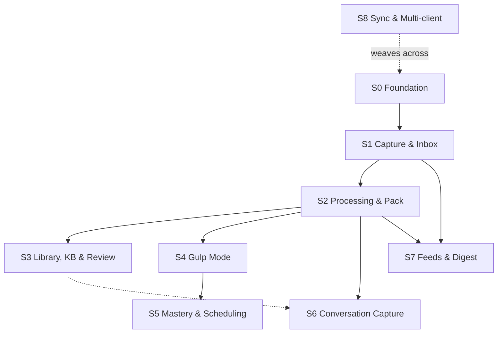

# 04 — Development Plan

*Gulp · subsystem decomposition & build plan · v1 · 2026-06-24*

> Companion to [`00-product-one-pager.md`](00-product-one-pager.md) (the *what/why*), [`01-interaction-spec.md`](01-interaction-spec.md) (the *how the user moves*), [`02-data-model.md`](02-data-model.md) (the *objects it's made of*), and [`03-ui-system.md`](03-ui-system.md) (the *how it looks*). Those four define the product; this doc defines **how we build it** — how the system splits into independently shippable subsystems, what capability each one carries, and in what order they come online.
>
> **Altitude:** decomposition + build sequence. This doc does exactly three things — **① cut the system into subsystems · ② state the capability each subsystem is responsible for · ③ lay out the build plan that connects them.** It deliberately stops *above* detailed design: no interfaces, no schemas, no screen-by-screen specs. **Each subsystem gets its own design doc later** (§6); this doc is the index and contract those docs hang off.

---

## 1. Scope & reading guide

- **Covers:** the full v1 product surface from `01`, partitioned into **8 capability subsystems** (`S1`–`S8`) on a **platform floor** (`S0`), plus **2 cross-cutting threads** (Onboarding, Notifications) that are woven rather than built standalone.
- **The cut is horizontal — by capability.** Each subsystem owns one slice of the product's capability, not one slice of the user journey. (Why horizontal, and what "validate" means under it: §2.)
- **Out of scope here:** any detailed design. Component anatomy, API shapes, prompts, schemas, and screen specs all live in the per-subsystem design docs (§6). Anything `01 §11` / `02 §10` / `03 §10` marked **deferred** stays deferred — it does not get a subsystem.
- **How to read it:** §2 is the method, §3 is the map (skim this first), §4 is one charter per subsystem (the bulk), §5 is the build order, §6 is how undetailed design gets filled in as we go.

---

## 2. Decomposition principles

The rules the cut obeys. When a "where does this belong?" question is ambiguous, resolve it toward these.

1. **One subsystem = one capability.** Each subsystem carries a single, nameable slice of product capability (capture, processing, practice, …). If a block needs two unrelated sentences to describe, it's two subsystems.
2. **Validate the capability the subsystem is responsible for — not the whole loop.** A subsystem is "done / validated" when *its own* designed capability meets *its own* success criteria. Capture is validated by *capture working well across content types*, not by whether the user eventually learned something. We do **not** require an end-to-end learning loop to sign off a block. Each charter (§4) names exactly what it must prove.
3. **Build for progressive connection.** Subsystems are sequenced so each one slots onto what's already there through the same objects the data model already defines (`02`). Connecting them is assembly, not rework.
4. **Detail just-in-time, per subsystem.** This doc holds each subsystem at capability altitude and parks its undetailed design questions in the charter. Those graduate into the subsystem's own design doc when it's that subsystem's turn to build (§6) — so unsettled design is captured, not lost, and not prematurely frozen.
5. **The data model is the shared contract.** Every subsystem reads and writes the entities in `02`. That common spine is what lets capability blocks be built apart and still fit together.

---

## 3. Subsystem map

Eight capability subsystems on a platform floor, plus two cross-cutting threads. Each maps to one or more flows in `01 §5` and entities in `02 §3`.

| | Subsystem | Capability it carries (validate this) | Maps to |
|---|---|---|---|
| **S0** | **Foundation** | Account, settings, per-client app shell & navigation, local persistence — the floor everything sits on | `01 §4.3`, `02 §4.1` |
| **S1** | **Capture & Inbox** | One-gesture intake of anything → a `Snapshot` in Inbox | `01 §F1`, `02 §4.3` |
| **S2** | **Processing & Knowledge Pack** | A `Snapshot` → AI `KnowledgePack` + draft `Card`s + concept links (the engine) | `01 §F2`, `02 §4.4/4.5` |
| **S3** | **Library, KB & Review** | Vet & commit packs into the graph; browse, relate, organize | `01 §F2/§F3`, `02 §4.6/4.9` |
| **S4** | **Gulp Mode** | The daily session: one prompt at a time, response + self-grade | `01 §F4` |
| **S5** | **Mastery & Scheduling** | Track mastery state; surface the right item at the right time | `01 §F7`, `02 §5` |
| **S6** | **Conversation Capture** | Chat anchored to any object → sediment into the library | `01 §F5`, `02 §4.7` |
| **S7** | **Feeds & Digest** | Subscriptions → a ranked, reasoned daily/weekly stream | `01 §F6`, `02 §4.8/4.11` |
| **S8** | **Sync & Multi-client** | Same state on all surfaces; offline-tolerant; cross-device continuity | `01 §3/§8/§10.4`, `02 §2.3` |
| *X1* | *Onboarding* (thread) | First capture → first gulp; woven across milestones | `01 §F8` |
| *X2* | *Notifications* (thread) | Re-engagement; each type lights up with its source subsystem | `01 §F9` |



> `S8 Sync` is drawn dashed because it is **woven, not stacked**: `S0`–`S7` ship single-device first, and sync is folded in across them rather than waiting at the end (§5). Onboarding and Notifications are likewise threads, not nodes.

---

## 4. Subsystem charters

Each charter is fixed-shape: **Responsibility · Scope (in / out for v1) · Validates (success criteria) · Dependencies (needs / unblocks) · Open design questions** (which graduate into the subsystem's own design doc, §6). Charters stay at capability altitude — no interfaces, no screens.

### S0 · Foundation

- **Responsibility:** the platform floor every other subsystem sits on — account & auth, the `User` settings entity (`02 §4.1`), the per-client app shell and navigation chrome (mobile tab bar / web sidebar, `01 §4.3`), and a local persistence layer the other subsystems read and write.
- **Scope — in:** minimal sign-in (`01 §F8`); settings storage; the empty navigable shell on **web first** (mobile shell deferred — §5); a local store later subsystems build on. **Out:** the sync engine (`S8`), notification delivery (`X2`), the mobile client (deferred, §5), and every knowledge feature.
- **Validates:** a user can sign in, set preferences, and move around an empty shell on web (mobile parity later, §5); data persists across restarts. *(Foundational / technical acceptance — there is no user-facing loop here yet, and that's expected per §2.2.)*
- **Dependencies:** needs nothing. **Unblocks:** everyone.
- **Open questions → design doc:** auth provider; local-store technology; the settings schema beyond `02 §4.1`.

### S1 · Capture & Inbox

- **Responsibility:** get anything into Gulp in one gesture and land it as a `Snapshot` in Inbox, never blocking on processing (`01 §F1`).
- **Scope — in:** in-app `⊕ Capture` and web paste (`⌘K`) first, then the external targets (OS share sheet, WeChat forward, email-in); the Capture-confirm sheet; `Snapshot` creation and its status up to the `processing` hand-off; **Inbox** as the derived "awaiting / unfiled" view (`02 D3`). **Out:** pack generation (`S2`), deep curation (`S3`), feed-emitted snapshots (`S7`).
- **Validates:** capture success rate across content types (link · article · PDF · video ref · note · screenshot · audio memo); one-gesture latency; "saved" confirms instantly and never waits on AI; the item reliably appears in Inbox.
- **Dependencies:** needs `S0`. **Unblocks:** `S2`, `S7`.
- **Open questions → design doc:** which capture targets ship first; dedupe by URL/hash (`01 §10.1`); the local offline-capture queue shape (real reconciliation deferred to `S8`).

### S2 · Processing & Knowledge Pack

> The product's core engine — the "digestion, not collection" thesis (`00`) lives or dies here. Expect the heaviest future design doc.

- **Responsibility:** turn a `Snapshot` into a structured `KnowledgePack` + draft `Card`s + concept links, asynchronously and invisibly-until-ready (`01 §F2`, `02 §4.4/4.5`).
- **Scope — in:** content fetch / parse / extract (`content_body`); chunking for long content; **knowledge-pack generation** (type-aware — a `pack_type` implementation per content type, `PaperPack` first; `02 §4.4`); **curriculum-driven draft-card generation** — grounds on `pack.render()` + the user's conversation, reasons a per-source curriculum as an internal chain-of-thought (not stored), then emits cards (future inputs: annotations, user model); `Concept` normalization & linking. **Out:** the review/commit gate and its UI (`S3`); scheduling (`S5`); the depth of the model-eval harness (its own doc).
- **Validates:** pack quality against a human spot-check bar; cards are actually testable; per-`Snapshot` latency and cost stay within budget; thin / long / failed / unsupported content degrade gracefully (`01 §10.2/10.3`).
- **Dependencies:** needs `S1` (Snapshots + content). **Unblocks:** `S3`, `S4`, `S6`, `S7`.
- **Open questions → design doc:** model choice & prompt structure; chunking strategy; the card-quality rubric and eval set; the cost/latency budget. *(This is the densest design doc in the set.)*

### S3 · Library, Knowledge Base & Review

> **Amendment (2026-07-02):** S3's v1 scope was realized as the **single-gate convergence** — per-card accept/reject is the only review gate (snapshot gate parked), Library = the `ready` list with tag filters, KB parked in favor of tags, Concepts frozen pending supply. See [`superpowers/specs/2026-07-02-single-gate-lifecycle-design.md`](superpowers/specs/2026-07-02-single-gate-lifecycle-design.md) and [`2026-07-02-card-generation-and-import-design.md`](superpowers/specs/2026-07-02-card-generation-and-import-design.md). The charter below is the original full ambition — its remainder (KB entity, Concept pages, graph) stays deferred.

- **Responsibility:** vet AI output and commit it into the knowledge graph (the review gate), then let the user browse, relate, and organize what they've gulped — Library, Knowledge bases, Concepts (`01 §F2` review + `§F3`, `02 §4.6/4.9`).
- **Scope — in:** the review model (lightweight batch-confirm on mobile in `Today`; deep curation on web); "Add to library" commit; auto-approve (global, with the per-feed override landing alongside `S7`); the Library list with filter chips (form · type · KB · mastery · due); Concept pages and the concept graph; Knowledge bases and membership. **Out:** card practice (`S4`); the AI drafting itself (`S2`).
- **Validates:** a user can vet and commit AI output; can find, relate, and organize objects; Concept pages render their connections; mastery state is legible per item.
- **Dependencies:** needs `S2`. **Unblocks:** scoped Gulp sessions ("Gulp this base/concept", `S4`); richer anchoring for `S6`.
- **Open questions → design doc:** review-UX depth and the batch/deep split; concept merge/split; KB digests; graph visualization (deferred per `01 §11`, surfaced minimally here).

### S4 · Gulp Mode

> The hero flow (`01 §F4`, `03 §7.7`). This is the screen the product is judged on.

- **Responsibility:** run the daily learning session — present one card at a time, capture the response and the self-grade.
- **Scope — in:** session composition (new + due + retests, interleaved); the prompt types (flashcard · mcq · cloze); reveal + source-grounded explanation + brief AI feedback on free responses; self-grade (`Got it / Fuzzy / Missed`) emitted as `ReviewEvent`s; the session summary; inline affordances ("Explain more" → `S6`, "Why am I seeing this?", "Snooze"). **Out:** the scheduling math (`S5` — `S4` only *emits* grades); the conversation engine internals (`S6`).
- **Validates:** a session feels good and completes in 5–10 min on both clients; strict one-thing-per-screen; grades are reliably captured. *(Validatable even before `S5` exists, by composing a session from a hand-built / flat card pool.)*
- **Dependencies:** needs `S2` (cards). **Unblocks:** `S5` (which consumes its `ReviewEvent`s).
- **Open questions → design doc:** session-length adaptation; free-response AI-feedback quality; prompt-type selection logic per card.

### S5 · Mastery & Scheduling

- **Responsibility:** make "do I actually know this?" a tracked, evolving state and surface the right item at the right time (`01 §F7`, `02 §5`).
- **Scope — in:** the `MasteryState` ladder (7 rungs stored) plus the derived 3-state / `due` / `at_risk` views; the `SchedulingState` v1 simple-interval model; the fold from append-only `ReviewEvent`s → schedule; due-count and at-risk surfacing; the daily-load cap and backlog spread. Architecture stays FSRS-ready (fields reserved, swap later). **Out:** the practice UI (`S4`); digest assembly (`S7`).
- **Validates:** graded cards resurface at sensible intervals; due counts are correct; misses return sooner; a backlog spike is capped and spread. *(Validate the engine's behavior over simulated time, independent of live sessions.)*
- **Dependencies:** needs `S4` (the grade stream). **Unblocks:** at-risk nudges (`X2`); mastery-aware digests (`S7`).
- **Open questions → design doc:** the v1 interval formula and its constants; the at-risk threshold; the FSRS migration trigger.

### S6 · Conversation Capture

- **Responsibility:** let the user interrogate any object and never lose what they learned — chat → sediment (`01 §F5`, `02 §4.7`).
- **Scope — in:** `Conversation` as a form of `Source`, anchored to a Source / Concept / Card / KB; messages with citation chips grounded on the underlying sources; the sediment proposal on exit (new points · corrected misconceptions · candidate cards · concepts touched · questions to review); accept → into library and scheduling; discard → keep the thread, create nothing. **Out:** the general pack pipeline (`S2`), though it reuses `S2`'s card-drafting and concept-linking machinery.
- **Validates:** a chat grounds on sources with working citations; on exit it proposes useful sediment; discard never loses the thread (no silent data loss, `02 §9.5`).
- **Dependencies:** needs `S2` (concept/card machinery) and `S3` (objects to anchor). **Unblocks:** a richer input stream into mastery.
- **Open questions → design doc:** sediment-extraction prompts and quality; citation grounding; anchor-context loading.

### S7 · Feeds & Digest

- **Responsibility:** turn followed feeds into a personalized, digestible stream — not an infinite inbox (`01 §F6`, `02 §4.8/4.11`).
- **Scope — in:** `Subscription` (RSS · newsletter · channel) and OPML import; auto-emitted `Snapshot`s (via `emitted_by`); Daily-digest and Weekly-review assembly with ranking and a per-item reason ("why it's worth your time, how it connects"); the per-feed auto-approve and mute controls; digest-item states. **Out:** ad-hoc capture (`S1`); the pack pipeline itself (reuses `S2`).
- **Validates:** a subscription reliably emits snapshots; the digest ranks and *explains*; a feed-fetch error never blocks the digest (`01 §F6`).
- **Dependencies:** needs `S1` + `S2`. **Unblocks:** the main re-engagement surface (`X2`).
- **Open questions → design doc:** ranking / assembly logic; digest cadence and volume defaults (`01 §11` open); noisy-feed controls.

### S8 · Sync & Multi-client

- **Responsibility:** make all surfaces read and write the same account state, offline-tolerant and cross-device continuous (`01 §3/§8/§10.4`, `02 §2.3`).
- **Scope — in:** the sync substrate (last-write-wins on scalars by `updated_at`, union on collections, soft-delete tombstones); the offline capture queue, cached reads, and local Gulp on cached due items; cross-device session resume ("continue where you left off"). **Out:** the realtime wire protocol details (its own doc, `02 §10`); single-device behavior, which `S0`–`S7` already ship locally.
- **Validates:** a change on one device appears on another within sync latency; offline capture and gulp work and reconcile on reconnect; conflicts resolve per the rules with no lost data.
- **Dependencies:** **woven across** — `S0`–`S7` are built single-device-first, and sync folds into each as it lands (§5). **Unblocks:** true multi-client use.
- **Open questions → design doc:** the sync-engine technology; conflict edge cases; the wire protocol (deferred, `02 §10`).

### Cross-cutting threads

These are **not** standalone subsystems — they only exist once other subsystems do, so they're woven across the build and validated at the milestone where they first make sense.

- **X1 · Onboarding** (`01 §F8`): first capture → first gulp. A stub appears with `S1`; the real aha ("I forwarded something and got tested on it") comes online once `S2` + `S4` exist; the batch-confirm / auto-approve path for mobile-only users completes once `S3` exists. Validated at the milestone where the loop first closes (§5).
- **X2 · Notifications** (`01 §F9`): re-engagement. Each notification type lights up as its source subsystem lands — "pack ready" needs `S2`, "at risk" needs `S5`, "weekly review" needs `S7`, the daily reminder needs `S4`. All opt-in, rate-limited, each deep-linking to one next action.

---

## 5. Build plan & sequencing

The dependency graph (§3) yields one natural build order. Validation stays **per-subsystem** (§2.2); the "connection points" below are descriptive milestones, not gates.

**Build order:**

```
S0  Foundation                         (floor — first, no deps)
S1  Capture & Inbox                    (needs S0)
S2  Processing & Pack                  (needs S1) ← the engine
S3  Library, KB & Review   ┐ (need S2; S3 and S4 can proceed in parallel)
S4  Gulp Mode              ┘
S5  Mastery & Scheduling               (needs S4's grade stream)
S6  Conversation Capture               (needs S2/S3)
S7  Feeds & Digest                     (needs S1 + S2)
S8  Sync & Multi-client                (woven from the start: single-device-first, then sync-in)
X1  Onboarding · X2  Notifications     (threaded; each lights up with its source subsystem)
```

**Connection points** (what the assembled system can do as blocks come online — for orientation only, **not** sign-off criteria):

| After | The system can… |
|---|---|
| `S1` + `S2` | capture anything and read back an AI knowledge pack |
| `+ S4` | run the **core loop** — capture → pack → practice (the product's aha) |
| `+ S5` | do **real spaced learning** — the right items resurface over time |
| `+ S3` | organize — vet, file, browse, relate via Concepts and KBs |
| `+ S6` | converse with any object and sediment what's learned |
| `+ S7` | feed the loop from subscriptions via a reasoned digest |
| `+ S8` | do all of it across devices, offline-tolerant |

**On `S8` being woven, not last:** sync is a foundational decision, but it does not have to be *built* first. `S0`–`S7` ship against a local store; each subsystem's entities already carry the sync-shaped fields (`02 §2.3`), so folding sync in is reconciliation work per entity, not a redesign. Building single-device-first lets every capability be validated on its own (§2.2) before multi-client cost is paid.

**On clients being sequenced web-first:** Gulp is multi-client eventually, but current development builds the **web client first** and folds mobile (Expo) in later — the same defer-and-weave logic as `S8`. Where a charter says "both clients" (`S0` shell, `S3` batch-confirm, `S4` session, …), **web is built and validated first; mobile parity is a later per-subsystem pass**, not a parallel build. The repo keeps `apps/mobile` as a reserved placeholder shell (`05 §7`) so the boundary exists without being built.

---

## 6. How designs get refined (just-in-time detailing)

This doc intentionally leaves each subsystem's internals open (§2.4). They get filled in **one subsystem at a time, when it's that subsystem's turn to build:**

1. **This doc is the index and contract.** The charter (§4) fixes each subsystem's responsibility, boundary, success criteria, and dependencies — the parts other subsystems rely on. Those are stable.
2. **Each subsystem spins out its own design doc** before it's built — e.g. `docs/subsystems/S2-processing-design.md` — at the altitude of `01`–`03` but scoped to that one capability: its flows, interfaces, screens, and data touchpoints.
3. **The charter's "Open design questions" are the seed** of that doc. They are carried here precisely so they are not lost and not frozen prematurely; they *graduate* into the subsystem's design doc and get resolved there, in build context.
4. **Resolved decisions flow back as references**, the same way `02` resolved `01 §11`'s open questions — so the doc set stays one connected chain rather than drifting copies.

> Net effect: the system is fully *partitioned* now, but only *detailed* on demand. We never block early work on late design, and we never build a subsystem whose neighbors haven't agreed on its boundary.

---

*Next docs in this set: the per-subsystem design docs (`docs/subsystems/SN-*.md`), authored in build order (§5) — `S0` and `S1` first, `S2` the deepest. Each resolves its charter's open questions (§4) and bridges to the physical schema / API contract that `02 §10` defers.*
